# 新人指南
### 文档说明
* 文档目的：帮助新人进行办公/开发所需要的软件安装与配置，了解软件的基本操作及技术文档的写作语法，确保入职后正常开展工作
* 适用人群：CamThink 项目组全员
* 版本说明：V1.0
## 一、安装前准备
### 1.1 设备检查
* 确认办公设备型号（台式机 / 笔记本）及系统版本（Windows 10/11）
* 检查设备存储空间：建议预留至少50GB空余空间
* 网络环境要求：需连接公司VPN网络
### 1.2 软件下载路径
* **需从官方网站下载（附：官方网站链接汇总）**
* **注意事项：严禁安装任何非官方渠道的软件（防病毒风险提示）**
## 二、项目软件安装
### 2.1 node.js
1. 打开官网 [Node.js](https://nodejs.org/zh-cn/ "访问官网")
2. 点击下载按钮 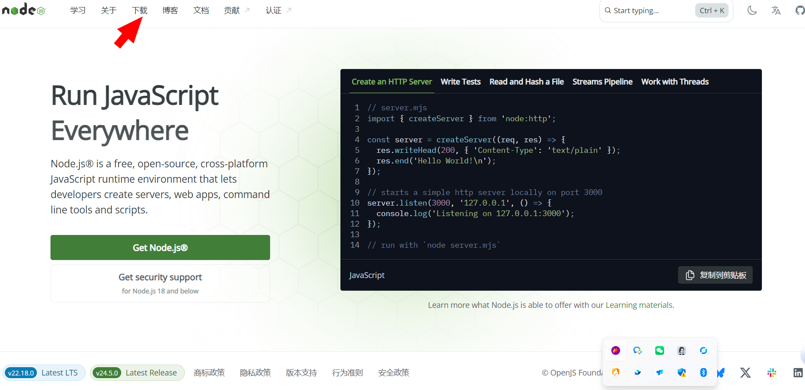
3. 点击Windows 安装程序 
4. 点击下载箭头（红圈内），打开下载的node 安装包 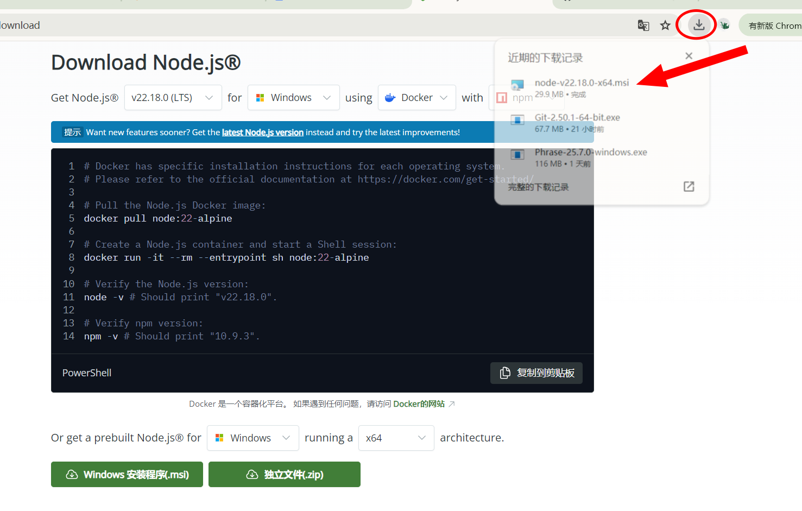
5. 跟随安装指引，点击next 
### 2.2 Visual Studio Code
1. 打开官网 [Visual Studio Code](https://code.visualstudio.com/ "访问官网")
2. 点击下载按钮 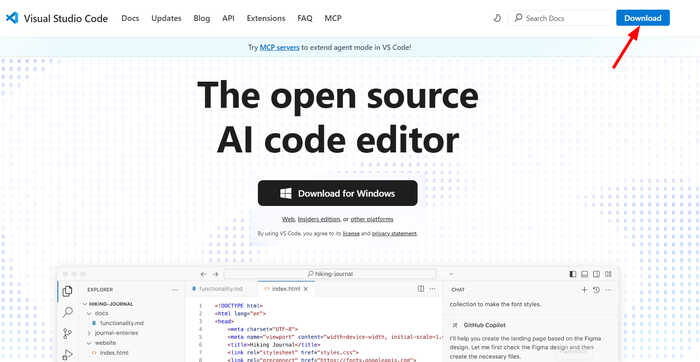
3. 点击Windows按钮 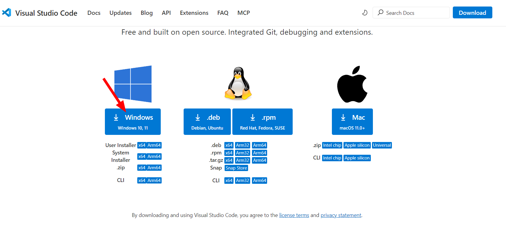
4. 点击下载箭头（红圈内），打开下载的Visual Studio Code 安装包 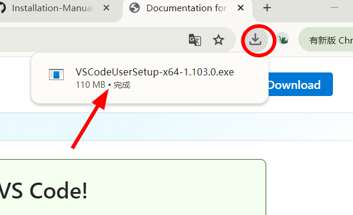
### 2.3 全局安装yarn
1. 通过npm安装yarn,确保电脑已经安装了Node.js
2. win+R 打开命令行窗口
3. 执行以下命令安装 Yarn：
	```npm install -g yarn```
4. 安装完成后，可以输入以下命令验证是否安装成功：
	```yarn --version```
	若显示版本号，说明安装成功
### 2.4 安装yarn install 依赖包
1. 通过npm安装yarn,确保电脑已经安装了Node.js
2. win+R 打开命令行窗口
3. 使用cd命令导航到你的项目根目录（即包含 package.json 文件的文件夹）
	例如：
	```cd C:\Users\你的用户名\项目文件夹名称\```
4. 在项目目录下输入以下命令：
	```yarn install```
5. 在文件管理器中查看项目根目录是否存在 node_modules，输入
	```dir node_modules ```
	若出现文件夹名称（如各种依赖包名称），说明依赖包安装成功
## 三、账户注册
### 3.1 GitHub账户
1. 打开官网 [GitHub](https://github.com/ "访问官网")
2. 创建账户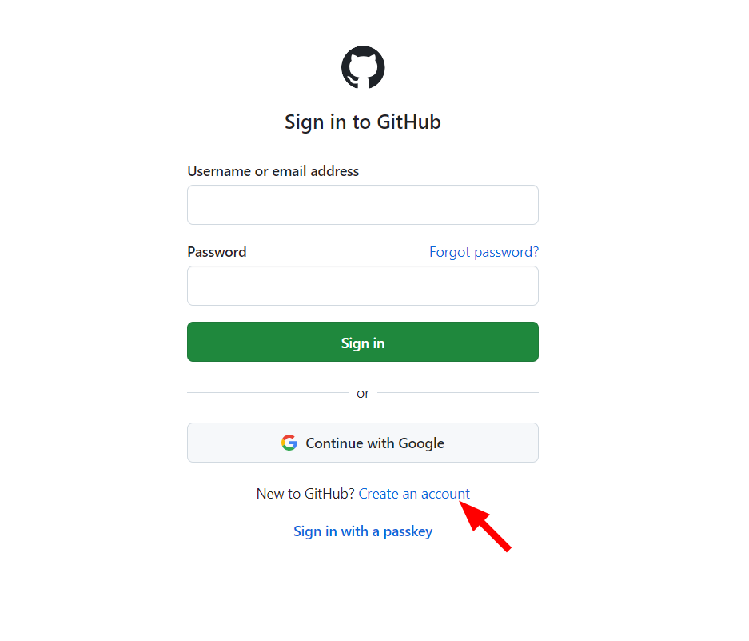
3. 填写账户信息，包括邮箱（用于账号验证，使用公司分配邮箱地址），密码，用户名，填写完成后点击create account 按钮 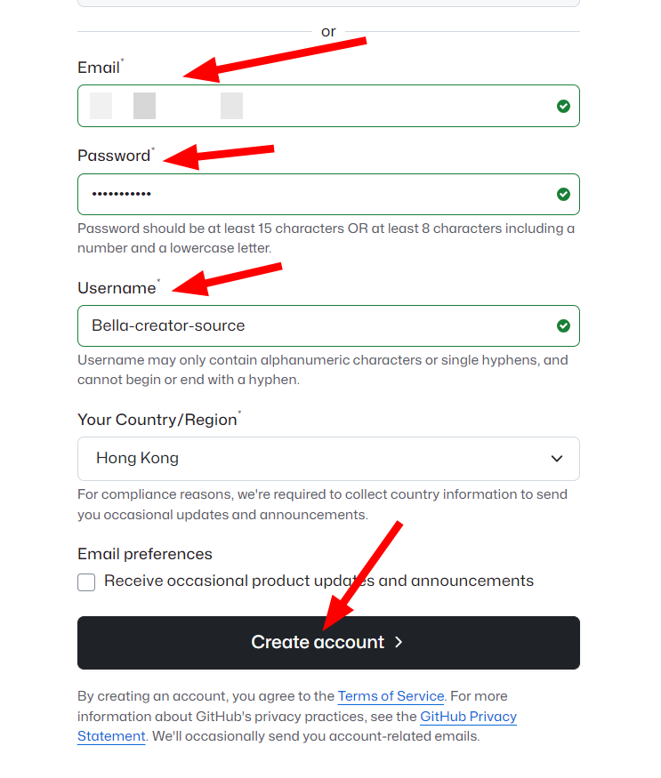
4. 填写邮件收到的GitHub验证码 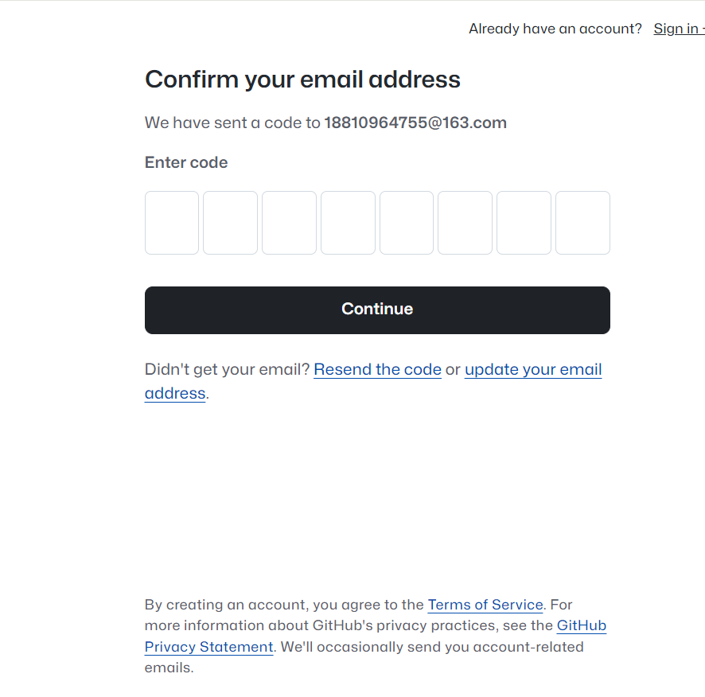
5. 填写用户名和密码，登录 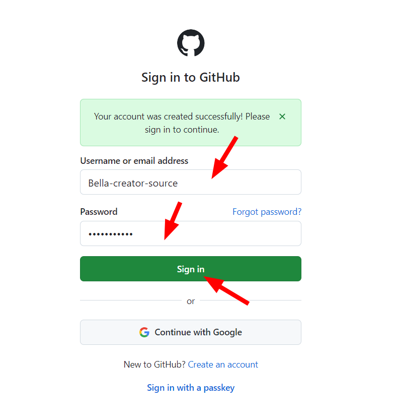
## 四、项目运行
#### （一）在本地创建项目仓库
##### 在GitHub上拥有一个仓库（两种途径）
*  **fork github仓库（你要运行的项目仓库）**
	1. 登录账户，在顶部搜索框输入"camthink-ai/wiki-documents（要复制的仓库路径）" 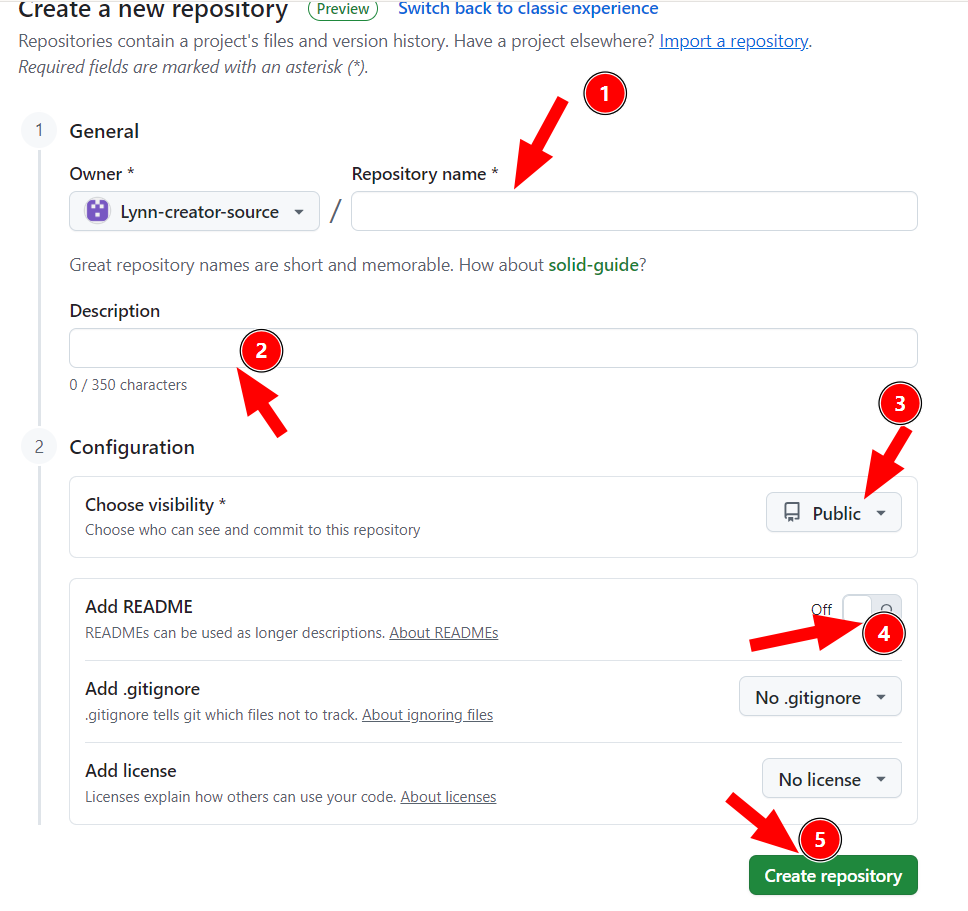
	2. 点击仓库右上角的fork按钮，将仓库复制到自己账号 
*  **创建github仓库（你要托管项目的仓库)**
	1. 登录账号，点击右上角＋号，创建new repository 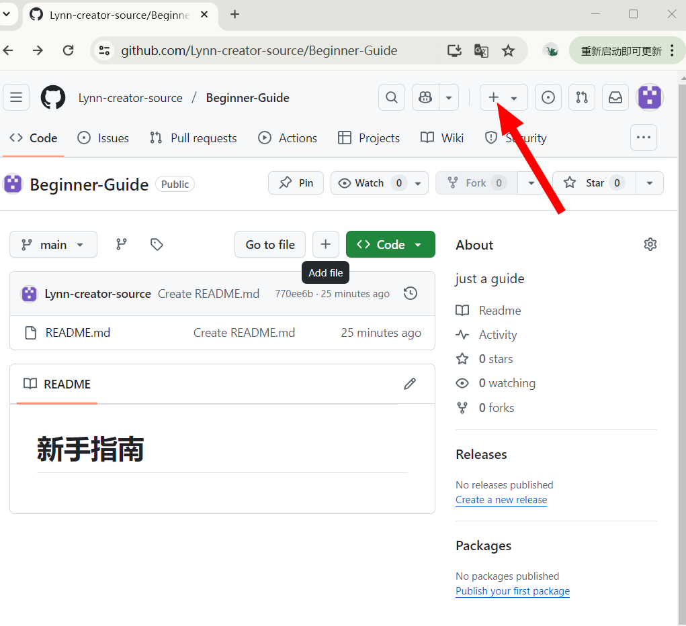
	2. 根据箭头指示，依次填写仓库名、描述、根据需求选择是否公开，默认公开，add README 选择on，最后点击创建仓库 
##### 将要运行的GitHub项目仓库克隆到本地
1. 在GitHub进入你要克隆的仓库，点击右上角code按钮 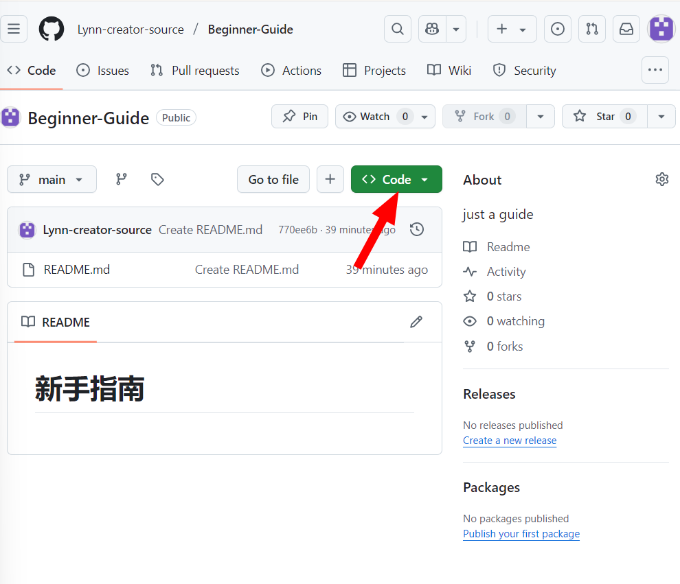
2. 点击复制按钮，复制仓库的url 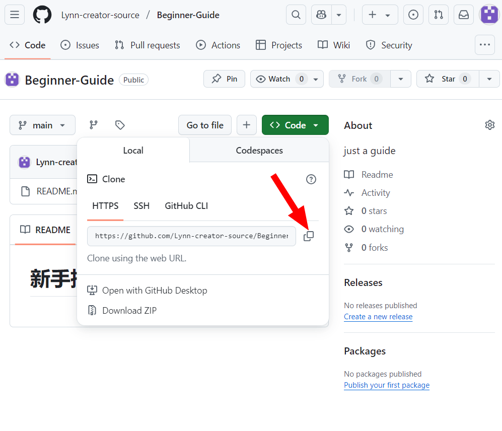
3. 打开vscode，首次使用先在终端配置Git 用户名和邮箱，之后可在vs中无缝使用Git功能，执行命令
	* ```git config --global user.email "你的邮箱"（配置 Git 全局用户邮箱 ）```
	* ```git config --global user.name "Lynn-creator-source"`（配置 Git 全局用户名 ）```
4. 打开你想要存放项目的地址
	* ```cd 你想要存放仓库的本地文件夹地址  #基于命令行窗口操作```
	* ```git clone 你复制的仓库的url地址 #基于命令行窗口的操作```
	* 或者，基于图形化界面操作
		* 按下快捷键 Ctrl + Shift + P（Windows/Linux），调出命令面板
		* 在命令面板的搜索框中输入 “Git: Clone” ，选择 “Git: Clone” 选项
		* 在弹出的输入框中粘贴从 GitHub 仓库页面复制的 url 地址（前面点击仓库页面绿色的 “Code” 按钮获取），然后回车
		* 选择本地用于存放克隆仓库的文件夹，点击 “选择文件夹”，VS Code 会自动开始克隆仓库
5. 在存放仓库的文件夹查找，是否新增你克隆仓库名的文件夹，若有，clone 成功
#### （二） 本地编辑项目
##### 本地修改项目
1. 建新分支专门用于本次修改（避免直接修改主分支，可以后期核查后，合并到主分支）
	*  ```cd 克隆的仓库本地地址```
	* ```git checkout -b 新分支名（如new-feather）# 基于终端命令行创建新分支```
	* 或者，基于图形化界面操作
		* 点击左侧 “源代码管理” 图标（分支图标），在面板底部找到当前分支（如`main`），点击它
		* 在弹出的菜单中选择 “新建分支”，输入分支名（如`feature/login`），回车确认，自动切换到新分支
 2. 本地修改项目,并保存
##### 本地运行项目
1. 安装yarn:```yarn install #首次克隆项目到本地时，必须安装依赖,x项目依赖更新后，也需要同步依赖版本```
2. 运行项目:```yarn start```
	* 若需要中英文切换，运行```yarn build ```，再运行```npm run serve```
3. 上传到GitHub
	* ```git push origin 你的分支名```
#### （三）将本地修改内容上传至GitHub
1. 查看修改并保存
	-   ```git status #查看修改的文件``` 
	-  ```git add.  # 添加所有改动的文件，也可以指定具体文件名，如 git add README.md```
	-  ```git commit -m "提交描述信息"  # 例如 git commit -m "Update README with new instructions,均为基于终端命令行的操作方式"```
	- 或者，基于图形化界面操作
		- 点击 VS Code 左侧边栏的 “源代码管理” 图标（类似分支的图标），打开源代码管理面板。在 “CHANGES” 区域，会显示出所有有改动的文件。文件前面的图标会标识出文件的状态，如 `M` 表示文件已修改，`U` 表示文件未跟踪（新添加的文件），`D` 表示文件已删除；
		- 在 “Message” 文本框中输入本次提交的描述信息（例如 “Update README file” ），然后勾选需要提交的文件（点击文件前的复选框），点击 “Commit” 按钮完成本地提交
2.  将修改后的内容推送到GitHub
	- ```git push origin 你的分支名 #推送到自己fork仓库的分支```
	- 或者
		- 点击源代码管理面板右上角的 “同步更改” 按钮（通常是一个带有向上和向下箭头的图标），VS Code 会先拉取远程仓库的最新代码（如果有），然后将本地提交推送到 GitHub 远程仓库
##### 全项目运行流程图
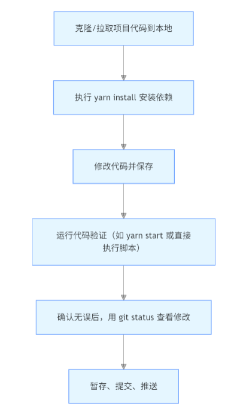
#### （四）在GitHub上通过PR提交合并请求（Pull Request，拉取请求）
###### 作用
	* 向仓库提交修改：如果你对某个仓库（比如开源项目或团队仓库）做了修改，通过 PR 可以把你的代码 “推” 给仓库维护者
	* 代码审核：仓库维护者可以在 PR 中查看你的修改内容、提出意见、讨论问题，确保代码质量
	* 协作记录：PR 会完整记录修改过程和讨论，方便后续追溯
1. **创建拉取请求**：
    - 进入 GitHub 仓库页面，点击 “Pull requests” 标签，然后点击 “New pull request” 按钮
    - 在 “Compare” 下拉菜单中，选择要合并到的基础分支（通常是`main`分支），在 “Against” 下拉菜单中，选择要合并的比较分支（即你开发新功能或进行修改的分支）
    - 查看两个分支间的差异，确认无误后，点击 “Create pull request” 按钮，输入标题和描述，再次点击 “Create pull request” 按钮
2. **代码审查**：
    - 其他团队成员可以在拉取请求页面上审查代码，并提出意见或建议。你可以根据反馈进行修改，修改后推送更改，PR 会自动更新
3. **解决冲突（如果有）**：
    - 如果存在合并冲突，GitHub 会在 PR 页面显示冲突文件。你需要将冲突文件下载到本地，手动解决冲突后，提交更改并推送到 GitHub
4. **合并拉取请求**：
    - 一旦得到审查批准，并解决了所有冲突，点击 “Merge pull request” 按钮。
    - 如果 “Merge pull request” 按钮不可见，可能是因为仓库设置了一些合并限制，比如需要通过某些状态检查。这种情况下，你可以点击 “Merge” 下拉菜单，根据需要选择 “Create a merge commit”“Squash and merge” 或 “Rebase and merge” 进行合并。
    - 点击 “Confirm merge” 完成合并
###### 操作过程
1. 登录Github账号，打开自己fork的仓库页面 
2. 页面会提示"刚刚推送了新分支"，点击旁边的Compare & pull request 按钮（若未显示，可先点击 `Pull requests` 标签页，再点击 `New pull request`）
3. 设置pr目标（重点）
	*  基础仓库（base repository）：选择团队主仓库（如 `团队名/项目名`）
	- 基础分支（base）：选择要合并到团队仓库的目标分支（如 `main`）
	- 比较仓库（head repository）：选择你的 fork 仓库（如 `你的用户名/项目名`）
	- 比较分支（compare）：选择你推送修改的分支（如 `feature/team-collab`）
4. 在 PR 页面填写信息：
	* 标题：简要说明 PR 的目的（如 “修复登录验证码错误”）
	* 描述：详细说明你做了什么修改、为什么这样改，方便审核者理解
5. 确认 PR 的目标分支（通常是原仓库的 main 或 master 分支），点击 Create pull request 完成创建
##### 后续：PR 创建后的协同流程
 1.  团队成员审核代码
	- 被指定的审核人会收到通知，在 PR 页面查看你的代码改动（`Files changed` 标签页）
	- 审核人可能会：
		- 直接批准（Approved）
	    - 提出修改建议（Request changes），并在代码旁添加评论（点击具体代码行的 + 号）
2. 根据反馈修改代码
	* 若需要修改，你可以在本地修改后，再次通过 git add → git commit → git push 推送到同一个分支，PR 会自动更新
	* 通知审核人再次查看（可在 PR 评论区留言：“已修改，请再次审核”）
3.  解决合并冲突（若有）
	- 若 PR 页面显示 `This branch has conflicts that must be resolved`，说明你的分支与团队主分支有冲突。
	- 解决步骤：
		- （1）本地拉取团队主分支的最新代码：
			* ``` git remote add upstream 项目URL #添加团队主仓库为远程仓库（首次操作）```
			* ```git fetch upstream```
			* ```git checkout main```
			* ```git merge upstream/main #将团队主分支同步到本地main```
		* （2） 切换到你的分支，合并本地 main 分支解决冲突：
			*  ```git checkout feather/team-collab```
			*  ```git merge main #此时会提示冲突文件``` 
		* （3）打开冲突文件，手动解决冲突（删除 `<<<<<<<` `=======` `>>>>>>>` 等标记，保留正确代码）
		* （4）提交并推送解决冲突后的代码：
			* ```git add .```
			* ```git commit -m "解决与main分支的合并冲突"```
			* ```git push origin feather/team-collab #PR会自动更新冲突状态```
4.  合并 PR 到团队主仓库
	* 审核通过后，维护者会点击 Merge pull request 将你的代码合并到原仓库
	* 选择合并方式（根据团队规范）：
	    - `Create a merge commit`：保留完整提交历史（推荐）
	    - `Squash and merge`：将所有提交压缩为一个（适合小型修改）
	    - `Rebase and merge`：保持线性提交历史（需无冲突）
	- 点击 **`Confirm merge`** 完成合并
5. 清理分支（可选）
	* 合并后，可在 PR 页面点击 **`Delete branch`** 删除你 fork 仓库中的功能分支（如 `feature/team-collab`），保持仓库整洁
#### （五）注意事项
1. **保持分支同步**：在开发过程中，定期从团队主仓库同步最新代码（`git fetch upstream` + `git merge upstream/main`），减少冲突概率
2. **小步提交**：每次 PR 尽量只包含一个功能或一个 bug 的修改，避免代码量过大导致审核困难
3. **及时响应**：审核人提出意见后，尽快修改并反馈，提高协同效率
按以上步骤操作，即可通过 PR 实现与团队的代码协同，确保你的修改被规范地合并到团队主仓库中。